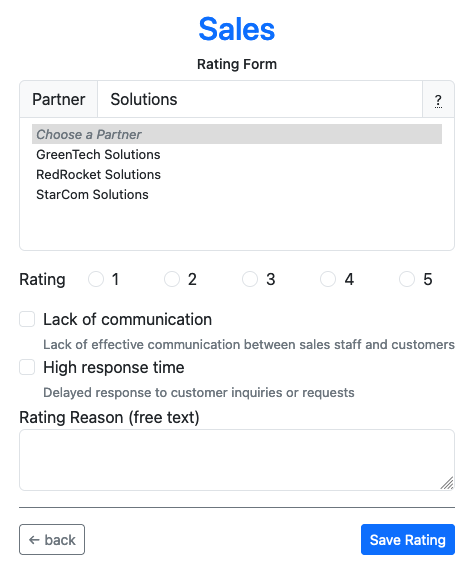

# Partner Rating

## What does it do?

This Extbase/Fluid based TYPO3 extension allows departments in a company to easily rate cooperation partners via a frontend form. The evaluation is based on school grades. Grades greater than a configurable limit value must be justified. This justification can be done either by predefined reasons or by a free text entry.

Special attention is paid to the fact that a large number of cooperation partners can be found quickly. This is possible through an AJAX-driven database search, which results in a dynamic adjustment of the partner selection field.

## What does it NOT do?
Currently there is no frontend access protection provided. The rating form is intended for internal use and should not be published unprotected. Therefore we recommend to use it either in the intranet, in a protected login area realized with TYPO3 on-board means or a password protection (for example via .htaccess file).

Furthermore, there is currently no possibility to statistically evaluate or display the collected rating data that is saved via the form. We therefore advise you to export the rating data as CSV with the TYPO3 on-board tools and to evaluate it with an external tool.

## Screenshots

### Frontend View:

### New Content Element Wizard:

### Plugin Settings:

### Records:

### Constant Editor:

## Further information

For more information, see the documentation at [docs.typo3.org](https://docs.typo3.org/p/erhaweb/partner-rating/main/en-us/).